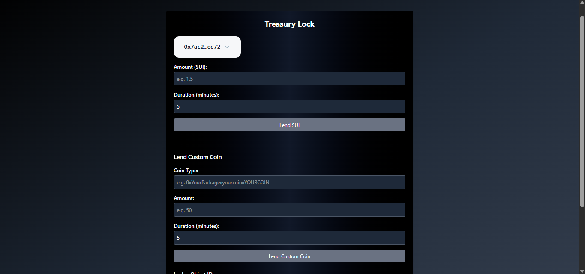

---

# 🔐 Sui Loan Locker – Time-Locked Lending with UI

A **Sui Move smart contract** and **React frontend** that lets users lock SUI tokens for a fixed time period and withdraw them only after the duration ends.
Includes a connected UI for lending, withdrawing, and viewing locker details.

---

## 🌐 Live Demo

## **[🚀 Launch App](https://lock-contract.vercel.app/)**

*Connect your wallet, lock SUI, and test withdrawals directly on Sui Testnet.*



---

## 📦 Features

### **On-Chain (Move Contract)**

* **Lock SUI (`lend`)** – Lock any `Coin<T>` for a specified number of minutes.
* **Withdraw After Lock (`withdraw_loan`)** – Withdraw locked funds after the duration expires.
* **Event Emission** – `LoanCreated` and `LoanWithdrawn` events for indexing.
* **Security Checks**

  * Zero-duration prevention
  * Early withdrawal restriction
  * Only lender can withdraw

### **Frontend (React + Sui dApp Kit)**

* Wallet connection via `ConnectButton`
* Lock SUI tokens with custom amount & duration
* Withdraw when eligible
* Fetch locker details from the blockchain
* Error handling for early withdrawals & invalid inputs
* Tailwind CSS UI

---

## 🧠 Contract Overview

### **Structs**

| Struct                    | Purpose                                                 |
| ------------------------- | ------------------------------------------------------- |
| `Locker<CoinType>`        | Stores locked balance, lender, start time, and duration |
| `LoanCreated<CoinType>`   | Event emitted when a loan is created                    |
| `LoanWithdrawn<CoinType>` | Event emitted when a loan is withdrawn                  |

---

## ❌ Errors

| Code | Name               | Description                        |
| ---- | ------------------ | ---------------------------------- |
| `0`  | `EInvalidDuration` | Duration must be > 0               |
| `1`  | `EUnauthorized`    | Only lender can withdraw           |
| `2`  | `ETooEarly`        | Cannot withdraw before unlock time |

---

## 🖥 UI Overview

The React UI interacts with the on-chain contract using:

* `@mysten/dapp-kit` for wallet connection & transactions
* `@mysten/sui/client` for blockchain queries
* `Transaction` API for Move calls

**UI Features:**

* **Lend SUI**: Specify amount & duration (in minutes)
* **Withdraw Loan**: After duration has passed
* **Get Locker Info**: Fetch on-chain locker details (lender, amount, start time, duration)

---

## 🚀 Getting Started

### **1. Clone Repo**

```bash
git clone https://github.com/tomcrown/lock-contract.move.git
cd lock_contract
```

### **2. Move Contract**

```bash
sui move build
sui client publish
sui move test
```

### **3. Frontend**

```bash
cd sui-locker-ui
pnpm install
pnpm dev
```

---

## 📜 Example UI Usage

### **Lock SUI**

1. Connect wallet
2. Enter amount in SUI
3. Enter duration in minutes
4. Click **"Lend SUI"**
5. Locker ID will be displayed after transaction confirmation

### **Withdraw Loan**

1. Paste **Locker Object ID**
2. Click **"Withdraw Loan"** (only after time has passed)

### **Get Locker Info**

1. Paste **Locker Object ID**
2. Click **"Get Locker Info"** to view details


---

## 🧪 Tests

Run unit tests for Move contract:

```bash
sui move test
```

---

## 🔍 Tech Stack

* **Blockchain**: Sui Move
* **Frontend**: React + TypeScript
* **Wallet Integration**: `@mysten/dapp-kit`
* **Blockchain Client**: `@mysten/sui/client`
* **Styling**: Tailwind CSS

---
